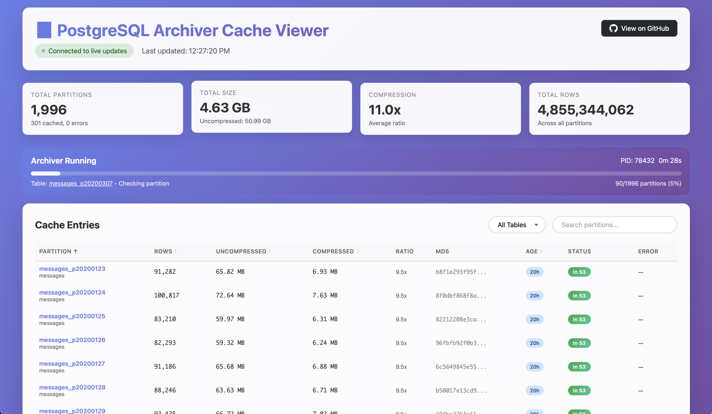

# PostgreSQL Archiver

[](https://github.com/airframesio/postgresql-archiver/actions/workflows/ci.yml)
[](https://goreportcard.com/report/github.com/airframesio/postgresql-archiver)
[](https://opensource.org/licenses/MIT)
[](go.mod)

A high-performance CLI tool for archiving PostgreSQL partitioned table data to S3-compatible object storage.

## Screenshots

### Terminal UI (TUI)


### Web-based Cache Viewer


## Features

- 🚀 **Parallel Processing** - Archive multiple partitions concurrently with configurable workers
- 📊 **Beautiful Progress UI** - Real-time progress tracking with dual progress bars
- 🌐 **Embedded Cache Viewer** - Beautiful web interface with real-time updates:
  - **WebSocket Live Updates** - Real-time data streaming without polling
  - Interactive task monitoring showing current partition and operation
  - Clickable partition names to jump directly to table row
  - Shows archiver status (running/idle) with PID tracking
  - Live statistics: total partitions, sizes, compression ratios
  - Sortable table with S3 upload status indicators
  - Smooth animations highlight data changes
  - Error tracking with timestamps
  - Auto-reconnecting WebSocket for reliability
- 💾 **Intelligent Caching** - Advanced caching system for maximum efficiency:
  - Caches row counts for 24 hours (refreshed daily)
  - Caches file metadata permanently (size, MD5, compression ratio)
  - Tracks errors with timestamps
  - Skip extraction/compression entirely when cached metadata matches S3
- 🔐 **Data Integrity** - Comprehensive file integrity verification:
  - Size comparison (both compressed and uncompressed)
  - MD5 hash verification for single-part uploads
  - Multipart ETag verification for large files (>100MB)
  - Automatic multipart upload for files >100MB
- ⚡ **Smart Compression** - Uses Zstandard compression with multi-core support
- 🔄 **Intelligent Resume** - Three-level skip detection:
  1. Fast skip using cached metadata (no extraction needed)
  2. Skip if S3 file matches after local processing
  3. Re-upload if size or hash differs
- 🎯 **Flexible Partition Support** - Handles multiple partition naming formats:
  - `table_YYYYMMDD` (e.g., `messages_20240315`)
  - `table_pYYYYMMDD` (e.g., `messages_p20240315`)
  - `table_YYYY_MM` (e.g., `messages_2024_03`)

## 📋 Prerequisites

- Go 1.21 or higher
- PostgreSQL database with partitioned tables (format: `tablename_YYYYMMDD`)
- S3-compatible object storage (Hetzner, AWS S3, MinIO, etc.)

## 🔧 Installation

```bash
git clone https://github.com/airframesio/postgresql-archiver.git
cd postgresql-archiver
go build -o postgresql-archiver
```

Or install directly:

```bash
go install github.com/airframesio/postgresql-archiver@latest
```

## 🚀 Quick Start

```bash
postgresql-archiver \
  --db-user myuser \
  --db-password mypass \
  --db-name mydb \
  --table flights \
  --s3-endpoint https://fsn1.your-objectstorage.com \
  --s3-bucket my-archive-bucket \
  --s3-access-key YOUR_ACCESS_KEY \
  --s3-secret-key YOUR_SECRET_KEY \
  --start-date 2024-01-01 \
  --end-date 2024-01-31
```

## 🎯 Usage

### Basic Command Structure

```bash
postgresql-archiver [flags]
```

### Help Output

```
PostgreSQL Archiver

A CLI tool to efficiently archive PostgreSQL partitioned table data to object storage.
Extracts data by day, converts to JSONL, compresses with zstd, and uploads to S3-compatible storage.

Usage:
  postgresql-archiver [flags]

Flags:
      --cache-viewer           start embedded cache viewer web server
      --config string          config file (default is $HOME/.postgresql-archiver.yaml)
      --db-host string         PostgreSQL host (default "localhost")
      --db-name string         PostgreSQL database name
      --db-password string     PostgreSQL password
      --db-port int            PostgreSQL port (default 5432)
      --db-user string         PostgreSQL user
  -d, --debug                  enable debug output
      --dry-run                perform a dry run without uploading
      --end-date string        end date (YYYY-MM-DD) (default "2025-08-27")
  -h, --help                   help for postgresql-archiver
      --s3-access-key string   S3 access key
      --s3-bucket string       S3 bucket name
      --s3-endpoint string     S3-compatible endpoint URL
      --s3-region string       S3 region (default "auto")
      --s3-secret-key string   S3 secret key
      --skip-count             skip counting rows (faster startup, no progress bars)
      --start-date string      start date (YYYY-MM-DD)
      --table string           base table name (required)
      --viewer-port int        port for cache viewer web server (default 8080)
      --workers int            number of parallel workers (default 4)
```

### Required Flags

- `--table` - Base table name (without date suffix)
- `--db-user` - PostgreSQL username
- `--db-name` - PostgreSQL database name
- `--s3-endpoint` - S3-compatible endpoint URL
- `--s3-bucket` - S3 bucket name
- `--s3-access-key` - S3 access key
- `--s3-secret-key` - S3 secret key

## ⚙️ Configuration

The tool supports three configuration methods (in order of precedence):

1. **Command-line flags** (highest priority)
2. **Environment variables** (prefix: `ARCHIVE_`)
3. **Configuration file** (lowest priority)

### Environment Variables

```bash
export ARCHIVE_DB_HOST=localhost
export ARCHIVE_DB_PORT=5432
export ARCHIVE_DB_USER=myuser
export ARCHIVE_DB_PASSWORD=mypass
export ARCHIVE_DB_NAME=mydb
export ARCHIVE_S3_ENDPOINT=https://fsn1.your-objectstorage.com
export ARCHIVE_S3_BUCKET=my-bucket
export ARCHIVE_S3_ACCESS_KEY=your_key
export ARCHIVE_S3_SECRET_KEY=your_secret
export ARCHIVE_TABLE=flights
export ARCHIVE_WORKERS=8
export ARCHIVE_CACHE_VIEWER=true
export ARCHIVE_VIEWER_PORT=8080
```

### Configuration File

Create `~/.postgresql-archiver.yaml`:

```yaml
db:
  host: localhost
  port: 5432
  user: myuser
  password: mypass
  name: mydb

s3:
  endpoint: https://fsn1.your-objectstorage.com
  bucket: my-archive-bucket
  access_key: your_access_key
  secret_key: your_secret_key
  region: auto

table: flights
workers: 8
start_date: "2024-01-01"
end_date: "2024-12-31"
cache_viewer: false  # Enable embedded cache viewer
viewer_port: 8080    # Port for cache viewer web server
```

## 📁 Output Structure

Files are organized in S3 with the following structure:

```
bucket/
└── export/
    └── table_name/
        └── YYYY/
            └── MM/
                └── YYYY-MM-DD.jsonl.zst
```

Example:
```
my-bucket/
└── export/
    └── flights/
        └── 2024/
            └── 01/
                ├── 2024-01-01.jsonl.zst
                ├── 2024-01-02.jsonl.zst
                └── 2024-01-03.jsonl.zst
```

## 🎨 Features in Detail

### Cache Viewer Web Interface

The archiver includes an embedded web server for monitoring cache and progress:

```bash
# Start archiver with embedded cache viewer
postgresql-archiver --cache-viewer --viewer-port 8080 [other options]

# Or run standalone cache viewer
postgresql-archiver cache-viewer --port 8080
```

Features:
- **WebSocket Real-time Updates**: Live data streaming with automatic reconnection
- **Interactive Status Panel**: 
  - Shows current partition being processed with clickable link
  - Displays specific operation (e.g., "Checking if exists", "Extracting", "Compressing", "Uploading")
  - Progress bar with completion percentage and partition count
  - Elapsed time tracking
- **Visual Change Detection**: Smooth animations highlight updated cells and stats
- **S3 Upload Status**: Shows which files are uploaded vs only processed locally
- **Comprehensive Metrics**: Shows both compressed and uncompressed sizes
- **Compression Ratios**: Visual display of space savings
- **Error Tracking**: Displays last error and timestamp for failed partitions
- **Smart Rendering**: No page flashing - only updates changed values
- **Sortable Columns**: Click any column header to sort (default: partition name)
- **File Counts**: Shows total partitions, processed, uploaded, and errors
- **Process Monitoring**: Checks if archiver is currently running via PID
- **Connection Status**: Visual indicator shows WebSocket connection state

Access the viewer at `http://localhost:8080` (or your configured port).

#### Technical Details

The cache viewer uses modern web technologies for optimal performance:
- **WebSocket Protocol**: Bi-directional communication for instant updates
- **Automatic Reconnection**: Reconnects every 2 seconds if connection drops
- **File System Monitoring**: Watches cache directory for changes (500ms intervals)
- **Efficient Updates**: Only transmits and renders changed data
- **No Polling Overhead**: WebSocket eliminates the need for HTTP polling

### Interactive Progress Display

The tool features a beautiful terminal UI with:
- **Per-partition progress bar**: Shows real-time progress for data extraction, compression, and upload
- **Overall progress bar**: Tracks completion across all partitions
- **Live statistics**: Displays elapsed time, estimated remaining time, and recent completions
- **Row counter**: Shows progress through large tables during extraction

### Partition Discovery

The tool automatically discovers partitions matching these naming patterns:

1. **Daily partitions (standard)**: `{base_table}_YYYYMMDD`
   - Example: `flights_20240101`, `flights_20240102`

2. **Daily partitions (with prefix)**: `{base_table}_pYYYYMMDD`
   - Example: `flights_p20240101`, `flights_p20240102`

3. **Monthly partitions**: `{base_table}_YYYY_MM`
   - Example: `flights_2024_01`, `flights_2024_02`
   - Note: Monthly partitions are processed as the first day of the month

For example, if your base table is `flights`, the tool will find and process all of these:
- `flights_20240101` (daily)
- `flights_p20240102` (daily with prefix)
- `flights_2024_01` (monthly)

### JSONL Format

Each row from the partition is exported as a single JSON object on its own line:

```json
{"id":1,"flight_number":"AA123","departure":"2024-01-01T10:00:00Z"}
{"id":2,"flight_number":"UA456","departure":"2024-01-01T11:00:00Z"}
```

### Compression

Uses Facebook's Zstandard compression with:
- Multi-core parallel compression
- "Better Compression" preset for optimal size/speed balance
- Typically achieves 5-10x compression ratios on JSON data

### Skip Logic

Files are skipped if:
- They already exist in S3 with the same path
- The file size matches (prevents re-uploading identical data)

## 🐛 Debugging

Enable debug mode for detailed output:

```bash
postgresql-archiver --debug --table flights ...
```

Debug mode shows:
- Database connection details
- Discovered partitions and row counts
- Extraction progress (every 10,000 rows)
- Compression ratios
- Upload destinations
- Detailed error messages

## 🏃 Dry Run Mode

Test your configuration without uploading:

```bash
postgresql-archiver --dry-run --table flights ...
```

This will:
- Connect to the database
- Discover partitions
- Extract and compress data
- Calculate file sizes and MD5 hashes
- Skip the actual upload

## 💾 Caching System

The archiver uses an intelligent two-tier caching system to maximize performance:

### Row Count Cache
- Caches partition row counts for 24 hours
- Speeds up progress bar initialization
- Always recounts today's partition for accuracy
- Cache location: `~/.postgresql-archiver/cache/{table}_metadata.json`

### File Metadata Cache
- Caches compressed/uncompressed sizes, MD5 hash, and S3 upload status
- Tracks whether files have been successfully uploaded to S3
- Enables fast skipping without extraction/compression on subsequent runs
- Validates against S3 metadata before skipping
- Preserves all metadata when updating row counts
- Stores error messages with timestamps for failed uploads
- File metadata is kept permanently (only row counts expire after 24 hours)

### Cache Efficiency
On subsequent runs with cached metadata:
1. Check cached size/MD5 against S3 (milliseconds)
2. Skip extraction and compression if match found
3. Result: 100-1000x faster for already-processed partitions

## 📊 Process Monitoring

The archiver provides real-time monitoring capabilities:

### PID Tracking
- Creates PID file at `~/.postgresql-archiver/archiver.pid` when running
- Allows external tools to check if archiver is active
- Automatically cleaned up on exit

### Task Progress File
- Writes current task details to `~/.postgresql-archiver/current_task.json`
- Includes:
  - Current operation (connecting, counting, extracting, uploading)
  - Progress percentage
  - Total and completed partitions
  - Start time and last update time
- Updated in real-time during processing

### Web API Endpoints
The cache viewer provides REST API and WebSocket endpoints:
- `/api/cache` - Returns all cached metadata (REST)
- `/api/status` - Returns archiver running status and current task (REST)
- `/ws` - WebSocket endpoint for real-time updates
  - Sends cache updates when files change
  - Streams status updates during archiving
  - Automatic reconnection support

## 🔐 Data Integrity Verification

The archiver ensures data integrity through multiple verification methods:

### Single-Part Uploads (files <100MB)
- Calculates MD5 hash of compressed data
- Compares with S3 ETag (which is MD5 for single-part uploads)
- Only skips if both size and MD5 match exactly

### Multipart Uploads (files ≥100MB)
- Automatically uses multipart upload for large files
- Calculates multipart ETag using S3's algorithm
- Verifies size and multipart ETag match before skipping

### Verification Process
1. **First Run**: Extract → Compress → Calculate MD5 → Upload → Cache metadata
2. **Subsequent Runs with Cache**: Check cache → Compare with S3 → Skip if match
3. **Subsequent Runs without Cache**: Extract → Compress → Calculate MD5 → Compare with S3 → Skip or upload

## 🔍 Examples

### Archive Last 30 Days

```bash
postgresql-archiver \
  --table events \
  --start-date $(date -d '30 days ago' +%Y-%m-%d) \
  --config ~/.archive-config.yaml
```

### Archive Specific Month with Debug

```bash
postgresql-archiver \
  --table transactions \
  --start-date 2024-06-01 \
  --end-date 2024-06-30 \
  --debug \
  --workers 8
```

### Dry Run with Custom Config

```bash
postgresql-archiver \
  --config production.yaml \
  --table orders \
  --dry-run \
  --debug
```

## 🚨 Error Handling

The tool provides detailed error messages for common issues:

- **Database Connection**: Checks connectivity before processing
- **Partition Discovery**: Reports invalid partition formats
- **Data Extraction**: Handles large datasets with streaming
- **Compression**: Reports compression failures and ratios
- **S3 Upload**: Retries on transient failures
- **Configuration**: Validates all required parameters

## 📊 Performance Tips

1. **Increase Workers**: Use `--workers` to process more partitions in parallel
2. **Network**: Ensure good bandwidth to S3 endpoint
3. **Database**: Add indexes on date columns for faster queries
4. **Memory**: Tool streams data to minimize memory usage
5. **Compression**: Multi-core zstd scales with CPU cores

## 🧪 Testing

The project includes a comprehensive test suite covering:

- **Cache Operations**: Row count and file metadata caching, TTL expiration, legacy migration
- **Configuration Validation**: Required fields, default values, date formats
- **Process Management**: PID file operations, task tracking, process status checks

Run tests with:

```bash
# Run all tests
go test ./...

# Run with verbose output
go test -v ./...

# Run with coverage
go test -cover ./...

# Run specific tests
go test -run TestPartitionCache ./cmd
```

## 🐳 Docker Support

Build and run with Docker:

```bash
# Build the Docker image
docker build -t postgresql-archiver .

# Run with environment variables
docker run --rm \
  -e ARCHIVE_DB_HOST=host.docker.internal \
  -e ARCHIVE_DB_USER=myuser \
  -e ARCHIVE_DB_PASSWORD=mypass \
  -e ARCHIVE_DB_NAME=mydb \
  -e ARCHIVE_S3_ENDPOINT=https://s3.example.com \
  -e ARCHIVE_S3_BUCKET=my-bucket \
  -e ARCHIVE_S3_ACCESS_KEY=key \
  -e ARCHIVE_S3_SECRET_KEY=secret \
  -e ARCHIVE_TABLE=events \
  postgresql-archiver

# Run with config file
docker run --rm \
  -v ~/.postgresql-archiver.yaml:/root/.postgresql-archiver.yaml \
  postgresql-archiver
```

## 🔧 Development

### Prerequisites

- Go 1.21+
- PostgreSQL database for testing
- S3-compatible storage for testing

### Building from Source

```bash
# Clone the repository
git clone https://github.com/airframesio/postgresql-archiver.git
cd postgresql-archiver

# Install dependencies
go mod download

# Build the binary
go build -o postgresql-archiver

# Run tests
go test ./...

# Build for different platforms
GOOS=linux GOARCH=amd64 go build -o postgresql-archiver-linux-amd64
GOOS=darwin GOARCH=arm64 go build -o postgresql-archiver-darwin-arm64
GOOS=windows GOARCH=amd64 go build -o postgresql-archiver.exe
```

### CI/CD

The project uses GitHub Actions for continuous integration:

- **Test Matrix**: Tests on Go 1.21.x and 1.22.x
- **Platforms**: Linux, macOS, Windows
- **Coverage**: Runs tests with coverage reporting
- **Linting**: Ensures code quality with golangci-lint
- **Binary Builds**: Creates binaries for multiple platforms

## 🤝 Contributing

Contributions are welcome! Please feel free to submit a Pull Request.

1. Fork the repository
2. Create your feature branch (`git checkout -b feature/amazing-feature`)
3. Commit your changes (`git commit -m 'Add some amazing feature'`)
4. Push to the branch (`git push origin feature/amazing-feature`)
5. Open a Pull Request

## 📄 License

MIT License - see LICENSE file for details

## 🙏 Acknowledgments

Built with these awesome libraries:
- [Charmbracelet](https://github.com/charmbracelet) - Beautiful CLI components
- [Cobra](https://github.com/spf13/cobra) - CLI framework
- [Viper](https://github.com/spf13/viper) - Configuration management
- [klauspost/compress](https://github.com/klauspost/compress) - Fast zstd compression
- [AWS SDK for Go](https://github.com/aws/aws-sdk-go) - S3 integration
- [Gorilla WebSocket](https://github.com/gorilla/websocket) - WebSocket implementation
