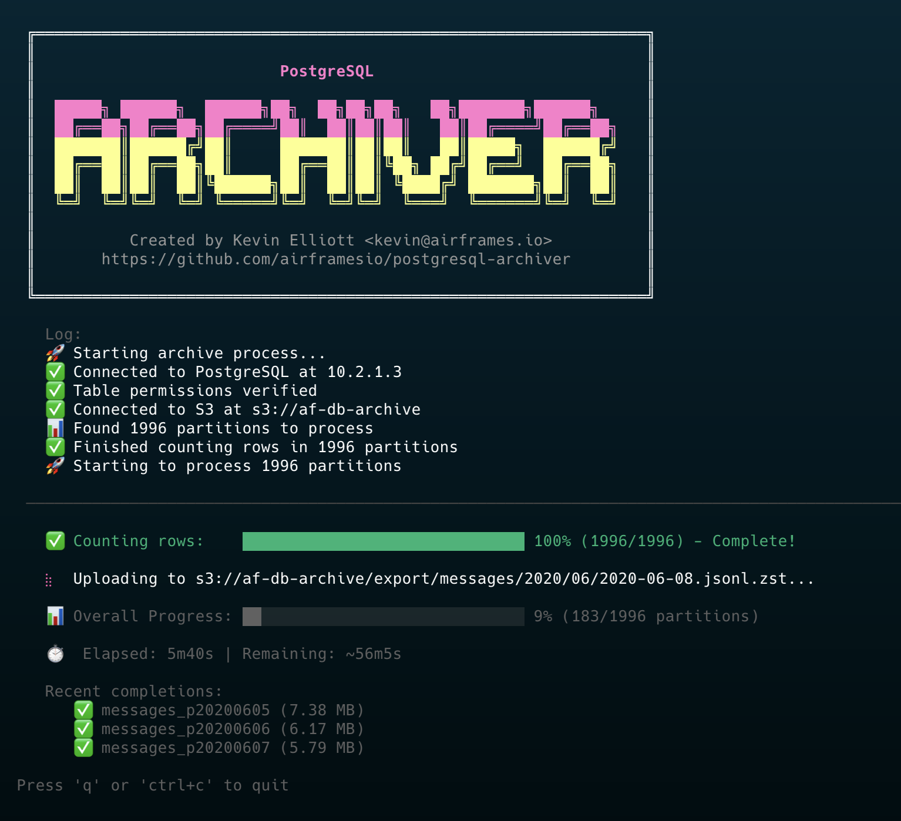

# PostgreSQL Archiver

A high-performance CLI tool for archiving PostgreSQL partitioned table data to S3-compatible object storage.



## Features

- 🚀 **Parallel Processing** - Archive multiple partitions concurrently with configurable workers
- 📊 **Beautiful Progress UI** - Real-time progress tracking with dual progress bars
- 💾 **Smart Caching** - Caches row counts for faster subsequent runs
- ⚡ **Compression** - Uses Zstandard compression with multi-core support
- 🔄 **Resume Support** - Skips already archived files based on object storage
- 🎯 **Flexible Partition Support** - Handles multiple partition naming formats:
  - `table_YYYYMMDD` (e.g., `messages_20240315`)
  - `table_pYYYYMMDD` (e.g., `messages_p20240315`)
  - `table_YYYY_MM` (e.g., `messages_2024_03`)

## 📋 Prerequisites

- Go 1.21 or higher
- PostgreSQL database with partitioned tables (format: `tablename_YYYYMMDD`)
- S3-compatible object storage (Hetzner, AWS S3, MinIO, etc.)

## 🔧 Installation

```bash
git clone https://github.com/airframes/postgresql-archiver.git
cd postgresql-archiver
go build -o postgresql-archiver
```

Or install directly:

```bash
go install github.com/airframes/postgresql-archiver@latest
```

## 🚀 Quick Start

```bash
postgresql-archiver \
  --db-user myuser \
  --db-password mypass \
  --db-name mydb \
  --table flights \
  --s3-endpoint https://fsn1.your-objectstorage.com \
  --s3-bucket my-archive-bucket \
  --s3-access-key YOUR_ACCESS_KEY \
  --s3-secret-key YOUR_SECRET_KEY \
  --start-date 2024-01-01 \
  --end-date 2024-01-31
```

## 🎯 Usage

### Basic Command Structure

```bash
postgresql-archiver [flags]
```

### Help Output

```
PostgreSQL Archiver

A CLI tool to efficiently archive PostgreSQL partitioned table data to object storage.
Extracts data by day, converts to JSONL, compresses with zstd, and uploads to S3-compatible storage.

Usage:
  postgresql-archiver [flags]

Flags:
      --config string          config file (default is $HOME/.postgresql-archiver.yaml)
      --db-host string         PostgreSQL host (default "localhost")
      --db-name string         PostgreSQL database name
      --db-password string     PostgreSQL password
      --db-port int            PostgreSQL port (default 5432)
      --db-user string         PostgreSQL user
  -d, --debug                  enable debug output
      --dry-run                perform a dry run without uploading
      --end-date string        end date (YYYY-MM-DD) (default "2025-08-27")
  -h, --help                   help for postgresql-archiver
      --s3-access-key string   S3 access key
      --s3-bucket string       S3 bucket name
      --s3-endpoint string     S3-compatible endpoint URL
      --s3-region string       S3 region (default "auto")
      --s3-secret-key string   S3 secret key
      --skip-count             skip counting rows (faster startup, no progress bars)
      --start-date string      start date (YYYY-MM-DD)
      --table string           base table name (required)
      --workers int            number of parallel workers (default 4)
```

### Required Flags

- `--table` - Base table name (without date suffix)
- `--db-user` - PostgreSQL username
- `--db-name` - PostgreSQL database name
- `--s3-endpoint` - S3-compatible endpoint URL
- `--s3-bucket` - S3 bucket name
- `--s3-access-key` - S3 access key
- `--s3-secret-key` - S3 secret key

## ⚙️ Configuration

The tool supports three configuration methods (in order of precedence):

1. **Command-line flags** (highest priority)
2. **Environment variables** (prefix: `ARCHIVE_`)
3. **Configuration file** (lowest priority)

### Environment Variables

```bash
export ARCHIVE_DB_HOST=localhost
export ARCHIVE_DB_PORT=5432
export ARCHIVE_DB_USER=myuser
export ARCHIVE_DB_PASSWORD=mypass
export ARCHIVE_DB_NAME=mydb
export ARCHIVE_S3_ENDPOINT=https://fsn1.your-objectstorage.com
export ARCHIVE_S3_BUCKET=my-bucket
export ARCHIVE_S3_ACCESS_KEY=your_key
export ARCHIVE_S3_SECRET_KEY=your_secret
export ARCHIVE_TABLE=flights
export ARCHIVE_WORKERS=8
```

### Configuration File

Create `~/.postgresql-archiver.yaml`:

```yaml
db:
  host: localhost
  port: 5432
  user: myuser
  password: mypass
  name: mydb

s3:
  endpoint: https://fsn1.your-objectstorage.com
  bucket: my-archive-bucket
  access_key: your_access_key
  secret_key: your_secret_key
  region: auto

table: flights
workers: 8
start_date: "2024-01-01"
end_date: "2024-12-31"
```

## 📁 Output Structure

Files are organized in S3 with the following structure:

```
bucket/
└── export/
    └── table_name/
        └── YYYY/
            └── MM/
                └── YYYY-MM-DD.jsonl.zst
```

Example:
```
my-bucket/
└── export/
    └── flights/
        └── 2024/
            └── 01/
                ├── 2024-01-01.jsonl.zst
                ├── 2024-01-02.jsonl.zst
                └── 2024-01-03.jsonl.zst
```

## 🎨 Features in Detail

### Interactive Progress Display

The tool features a beautiful terminal UI with:
- **Per-partition progress bar**: Shows real-time progress for data extraction, compression, and upload
- **Overall progress bar**: Tracks completion across all partitions
- **Live statistics**: Displays elapsed time, estimated remaining time, and recent completions
- **Row counter**: Shows progress through large tables during extraction

### Partition Discovery

The tool automatically discovers partitions matching these naming patterns:

1. **Daily partitions (standard)**: `{base_table}_YYYYMMDD`
   - Example: `flights_20240101`, `flights_20240102`

2. **Daily partitions (with prefix)**: `{base_table}_pYYYYMMDD`
   - Example: `flights_p20240101`, `flights_p20240102`

3. **Monthly partitions**: `{base_table}_YYYY_MM`
   - Example: `flights_2024_01`, `flights_2024_02`
   - Note: Monthly partitions are processed as the first day of the month

For example, if your base table is `flights`, the tool will find and process all of these:
- `flights_20240101` (daily)
- `flights_p20240102` (daily with prefix)
- `flights_2024_01` (monthly)

### JSONL Format

Each row from the partition is exported as a single JSON object on its own line:

```json
{"id":1,"flight_number":"AA123","departure":"2024-01-01T10:00:00Z"}
{"id":2,"flight_number":"UA456","departure":"2024-01-01T11:00:00Z"}
```

### Compression

Uses Facebook's Zstandard compression with:
- Multi-core parallel compression
- "Better Compression" preset for optimal size/speed balance
- Typically achieves 5-10x compression ratios on JSON data

### Skip Logic

Files are skipped if:
- They already exist in S3 with the same path
- The file size matches (prevents re-uploading identical data)

## 🐛 Debugging

Enable debug mode for detailed output:

```bash
postgresql-archiver --debug --table flights ...
```

Debug mode shows:
- Database connection details
- Discovered partitions and row counts
- Extraction progress (every 10,000 rows)
- Compression ratios
- Upload destinations
- Detailed error messages

## 🏃 Dry Run Mode

Test your configuration without uploading:

```bash
postgresql-archiver --dry-run --table flights ...
```

This will:
- Connect to the database
- Discover partitions
- Extract and compress data
- Calculate file sizes
- Skip the actual upload

## 🔍 Examples

### Archive Last 30 Days

```bash
postgresql-archiver \
  --table events \
  --start-date $(date -d '30 days ago' +%Y-%m-%d) \
  --config ~/.archive-config.yaml
```

### Archive Specific Month with Debug

```bash
postgresql-archiver \
  --table transactions \
  --start-date 2024-06-01 \
  --end-date 2024-06-30 \
  --debug \
  --workers 8
```

### Dry Run with Custom Config

```bash
postgresql-archiver \
  --config production.yaml \
  --table orders \
  --dry-run \
  --debug
```

## 🚨 Error Handling

The tool provides detailed error messages for common issues:

- **Database Connection**: Checks connectivity before processing
- **Partition Discovery**: Reports invalid partition formats
- **Data Extraction**: Handles large datasets with streaming
- **Compression**: Reports compression failures and ratios
- **S3 Upload**: Retries on transient failures
- **Configuration**: Validates all required parameters

## 📊 Performance Tips

1. **Increase Workers**: Use `--workers` to process more partitions in parallel
2. **Network**: Ensure good bandwidth to S3 endpoint
3. **Database**: Add indexes on date columns for faster queries
4. **Memory**: Tool streams data to minimize memory usage
5. **Compression**: Multi-core zstd scales with CPU cores

## 🤝 Contributing

Contributions are welcome! Please feel free to submit a Pull Request.

## 📄 License

MIT License - see LICENSE file for details

## 🙏 Acknowledgments

Built with these awesome libraries:
- [Charmbracelet](https://github.com/charmbracelet) - Beautiful CLI components
- [Cobra](https://github.com/spf13/cobra) - CLI framework
- [Viper](https://github.com/spf13/viper) - Configuration management
- [klauspost/compress](https://github.com/klauspost/compress) - Fast zstd compression
- [AWS SDK for Go](https://github.com/aws/aws-sdk-go) - S3 integration