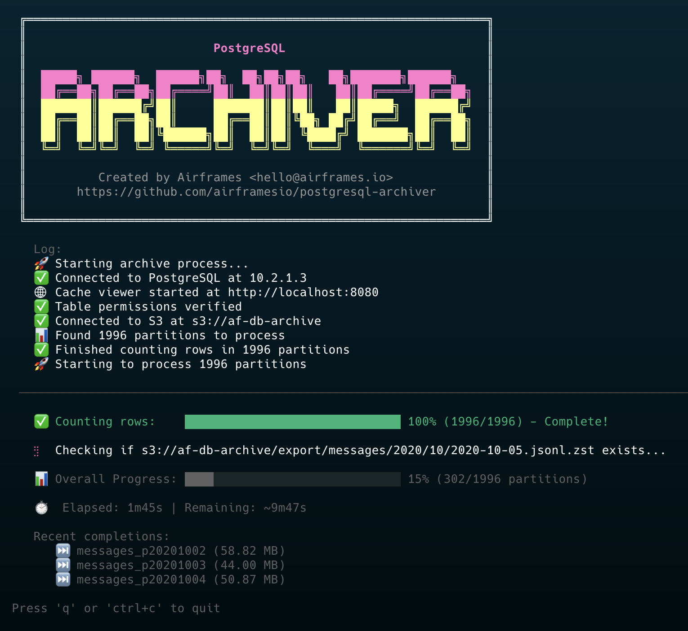

# Data Archiver

[](https://github.com/airframesio/data-archiver/actions/workflows/ci.yml)
[](https://goreportcard.com/report/github.com/airframesio/data-archiver)
[](https://opensource.org/licenses/MIT)
[](go.mod)

A high-performance CLI tool for archiving database data to S3-compatible object storage.

**Currently supports:** PostgreSQL input (partitioned tables, plus non-partitioned tables when `--date-column`, `--start-date`, and `--end-date` are provided) and S3-compatible object storage output.

## Screenshots

### Terminal UI (TUI)


### Web-based Cache Viewer


## Features

- 🚀 **Parallel Processing** - Archive multiple partitions concurrently with configurable workers
- 📊 **Beautiful Progress UI** - Real-time progress tracking with dual progress bars
- 🌐 **Embedded Cache Viewer** - Beautiful web interface with real-time updates:
  - **WebSocket Live Updates** - Real-time data streaming without polling
  - Interactive task monitoring showing current partition and operation
  - Clickable partition names to jump directly to table row
  - Shows archiver status (running/idle) with PID tracking
  - Live statistics: total partitions, sizes, compression ratios
  - Sortable table with S3 upload status indicators
  - Smooth animations highlight data changes
  - Error tracking with timestamps
  - Auto-reconnecting WebSocket for reliability
- 💾 **Intelligent Caching** - Advanced caching system for maximum efficiency:
  - Caches row counts for 24 hours (refreshed daily)
  - Caches file metadata permanently (size, MD5, compression ratio)
  - Tracks errors with timestamps
  - Skip extraction/compression entirely when cached metadata matches S3
- 🔐 **Data Integrity** - Comprehensive file integrity verification:
  - Size comparison (both compressed and uncompressed)
  - MD5 hash verification for single-part uploads
  - Multipart ETag verification for large files (>100MB)
  - Automatic multipart upload for files >100MB
- ⚡ **Smart Compression** - Uses Zstandard compression with multi-core support
- 🔄 **Intelligent Resume** - Three-level skip detection:
  1. Fast skip using cached metadata (no extraction needed)
  2. Skip if S3 file matches after local processing
  3. Re-upload if size or hash differs
- 🎯 **Flexible Partition Support** - Handles multiple partition naming formats:
  - `table_YYYYMMDD` (e.g., `messages_20240315`)
  - `table_pYYYYMMDD` (e.g., `messages_p20240315`)
  - `table_YYYY_MM` (e.g., `messages_2024_03`)

## 📋 Prerequisites

- Go 1.22 or higher
- PostgreSQL database with partitioned tables (format: `tablename_YYYYMMDD`) **or** non-partitioned tables when you supply `--date-column`, `--start-date`, and `--end-date` so the archiver can build synthetic windows
- S3-compatible object storage (Hetzner, AWS S3, MinIO, etc.)

## 🔧 Installation

### Homebrew (macOS/Linux)

The easiest way to install on macOS or Linux:

```bash
brew install airframesio/tap/data-archiver
```

### Pre-built Binaries

Download the latest release for your platform from the [releases page](https://github.com/airframesio/data-archiver/releases).

### Go Install

```bash
go install github.com/airframesio/data-archiver@latest
```

### Build from Source

```bash
git clone https://github.com/airframesio/data-archiver.git
cd data-archiver
go build -o data-archiver
```

## 🚀 Quick Start

```bash
data-archiver \
  --db-user myuser \
  --db-password mypass \
  --db-name mydb \
  --table flights \
  --s3-endpoint https://fsn1.your-objectstorage.com \
  --s3-bucket my-archive-bucket \
  --s3-access-key YOUR_ACCESS_KEY \
  --s3-secret-key YOUR_SECRET_KEY \
  --path-template "archives/{table}/{YYYY}/{MM}" \
  --start-date 2024-01-01 \
  --end-date 2024-01-31
```

**Advanced Example with Custom Output:**
```bash
data-archiver \
  --db-user myuser \
  --db-password mypass \
  --db-name mydb \
  --table flights \
  --s3-endpoint https://fsn1.your-objectstorage.com \
  --s3-bucket my-archive-bucket \
  --s3-access-key YOUR_ACCESS_KEY \
  --s3-secret-key YOUR_SECRET_KEY \
  --path-template "data/{table}/year={YYYY}/month={MM}" \
  --output-format parquet \
  --compression lz4 \
  --compression-level 5 \
  --output-duration daily \
  --start-date 2024-01-01 \
  --end-date 2024-01-31
```

## 🎯 Usage

### Basic Command Structure

```bash
# Archive data to S3
data-archiver archive [flags]

# Dump database using pg_dump to S3
data-archiver dump [flags]

# Dump schema once, then emit date-sliced data dumps via pg_dump
data-archiver dump-hybrid [flags]

# Restore data from S3
data-archiver restore [flags]
```

### Help Output

```
Data Archiver

A CLI tool to efficiently archive database data to object storage.
Supports multiple output formats (JSONL/CSV/Parquet), compression types (Zstandard/LZ4/Gzip),
and flexible path templates for S3-compatible storage.

Usage:
  data-archiver [flags]

Flags:
      --viewer                       start embedded cache viewer web server
      --compression string           compression type: zstd, lz4, gzip, none (default "zstd")
      --compression-level int        compression level (zstd: 1-22, lz4/gzip: 1-9, none: 0) (default 3)
      --config string                config file (default is $HOME/.data-archiver.yaml)
      --date-column string           timestamp column name for duration-based splitting (optional)
      --db-host string               PostgreSQL host (default "localhost")
      --db-name string               PostgreSQL database name
      --db-password string           PostgreSQL password
      --db-port int                  PostgreSQL port (default 5432)
      --db-sslmode string            PostgreSQL SSL mode (disable, require, verify-ca, verify-full) (default "disable")
      --db-user string               PostgreSQL user
  -d, --debug                        enable debug output
      --dry-run                      perform a dry run without uploading
      --end-date string              end date (YYYY-MM-DD) (default "2025-08-27")
  -h, --help                         help for data-archiver
      --output-duration string       output file duration: hourly, daily, weekly, monthly, yearly (default "daily")
      --output-format string         output format: jsonl, csv, parquet (default "jsonl")
      --path-template string         S3 path template with placeholders: {table}, {YYYY}, {MM}, {DD}, {HH} (required)
      --s3-access-key string         S3 access key
      --s3-bucket string             S3 bucket name
      --s3-endpoint string           S3-compatible endpoint URL
      --s3-region string             S3 region (default "auto")
      --s3-secret-key string         S3 secret key
      --skip-count                   skip counting rows (faster startup, no progress bars)
      --start-date string            start date (YYYY-MM-DD)
      --table string                 base table name (required)
      --viewer-port int              port for cache viewer web server (default 8080)
      --workers int                  number of parallel workers (default 4)
```

### Required Flags

- `--table` - Base table name (without date suffix)
- `--path-template` - S3 path template with placeholders (e.g., `"archives/{table}/{YYYY}/{MM}"`)
- `--db-user` - PostgreSQL username
- `--db-name` - PostgreSQL database name
- `--s3-endpoint` - S3-compatible endpoint URL
- `--s3-bucket` - S3 bucket name
- `--s3-access-key` - S3 access key
- `--s3-secret-key` - S3 secret key

### Output Configuration Flags

- `--output-format` - Output file format: `jsonl` (default), `csv`, or `parquet`
- `--compression` - Compression type: `zstd` (default), `lz4`, `gzip`, or `none`
- `--compression-level` - Compression level (default: 3)
  - Zstandard: 1-22 (higher = better compression, slower)
  - LZ4/Gzip: 1-9 (higher = better compression, slower)
- `--output-duration` - File duration: `hourly`, `daily` (default), `weekly`, `monthly`, or `yearly`
- `--date-column` - Timestamp column for duration-based splitting. Required when archiving non-partitioned tables so the archiver can build synthetic windows.
- `--chunk-size` - Number of rows to process per chunk (default: 10000, range: 100-1000000)
  - Tune based on average row size for optimal memory usage
  - Smaller chunks for large rows, larger chunks for small rows

### Working with Non-Partitioned Tables

The archive command now supports base tables that aren't physically partitioned. Provide:

- `--date-column` so rows can be filtered by time
- `--start-date` and `--end-date` to define the overall range
- `--output-duration` to control the slice size (daily, weekly, etc.)

When no partitions are discovered, the archiver automatically slices the base table into synthetic windows covering the requested range and streams each window through the normal extraction/compression/upload pipeline.

### Hybrid pg_dump workflow

Use `data-archiver dump-hybrid` when you need a schema dump plus partitioned data files generated directly by `pg_dump`.

- Step 1: Dump the parent table schema once (partitions are automatically excluded).
- Step 2: Discover partitions that match the provided date range and upload grouped dumps using `--path-template` + `--output-duration`.
- Any dates not covered by physical partitions are still exported by filtering the parent table via temporary staging tables, so mixed partition/non-partition layouts are supported.
- Ideal for storing schema metadata next to date-windowed `pg_dump` archives without manual SQL.
- Requires `--date-column` so non-partitioned tables can be filtered via `pg_dump --where`.

Example: dump the `events` table schema plus daily data files for January 2024.

```bash
data-archiver dump-hybrid \
  --db-host localhost \
  --db-port 5432 \
  --db-user myuser \
  --db-password mypass \
  --db-name analytics \
  --table events \
  --date-column created_at \
  --start-date 2024-01-01 \
  --end-date 2024-01-31 \
  --s3-endpoint https://s3.example.com \
  --s3-bucket pg-dumps \
  --s3-access-key YOUR_KEY \
  --s3-secret-key YOUR_SECRET \
  --path-template "pgdumps/{table}/{YYYY}/{MM}" \
  --output-duration daily
```

The schema is uploaded once (e.g., `pgdumps/events/schema.dump`), then `pg_dump` writes compressed custom-format data for each daily/weekly/monthly grouping such as `pgdumps/events/2024/01/events-2024-01-05.dump`.

## ⚙️ Configuration

The tool supports three configuration methods (in order of precedence):

1. **Command-line flags** (highest priority)
2. **Environment variables** (prefix: `ARCHIVE_`)
3. **Configuration file** (lowest priority)

### Environment Variables

```bash
export ARCHIVE_DB_HOST=localhost
export ARCHIVE_DB_PORT=5432
export ARCHIVE_DB_USER=myuser
export ARCHIVE_DB_PASSWORD=mypass
export ARCHIVE_DB_NAME=mydb
export ARCHIVE_DB_SSLMODE=disable
export ARCHIVE_S3_ENDPOINT=https://fsn1.your-objectstorage.com
export ARCHIVE_S3_BUCKET=my-bucket
export ARCHIVE_S3_ACCESS_KEY=your_key
export ARCHIVE_S3_SECRET_KEY=your_secret
export ARCHIVE_S3_PATH_TEMPLATE="archives/{table}/{YYYY}/{MM}"
export ARCHIVE_TABLE=flights
export ARCHIVE_OUTPUT_FORMAT=jsonl           # Options: jsonl, csv, parquet
export ARCHIVE_COMPRESSION=zstd              # Options: zstd, lz4, gzip, none
export ARCHIVE_COMPRESSION_LEVEL=3           # zstd: 1-22, lz4/gzip: 1-9
export ARCHIVE_OUTPUT_DURATION=daily         # Options: hourly, daily, weekly, monthly, yearly
export ARCHIVE_WORKERS=8
export ARCHIVE_CACHE_VIEWER=true
export ARCHIVE_VIEWER_PORT=8080
```

### Configuration File

Create `~/.data-archiver.yaml`:

```yaml
db:
  host: localhost
  port: 5432
  user: myuser
  password: mypass
  name: mydb
  sslmode: disable  # Options: disable, require, verify-ca, verify-full

s3:
  endpoint: https://fsn1.your-objectstorage.com
  bucket: my-archive-bucket
  access_key: your_access_key
  secret_key: your_secret_key
  region: auto
  path_template: "archives/{table}/{YYYY}/{MM}"  # S3 path template with placeholders

table: flights
output_format: jsonl          # Options: jsonl, csv, parquet
compression: zstd             # Options: zstd, lz4, gzip, none
compression_level: 3          # zstd: 1-22, lz4/gzip: 1-9
output_duration: daily        # Options: hourly, daily, weekly, monthly, yearly
workers: 8
start_date: "2024-01-01"
end_date: "2024-12-31"
cache_viewer: false           # Enable embedded cache viewer
viewer_port: 8080             # Port for cache viewer web server
```

## 📁 Output Structure

Files are organized in S3 based on your configured `--path-template`. The tool supports flexible path templates with the following placeholders:

- `{table}` - Table name
- `{YYYY}` - 4-digit year
- `{MM}` - 2-digit month
- `{DD}` - 2-digit day
- `{HH}` - 2-digit hour (for hourly duration)

**Example with default settings** (`--path-template "archives/{table}/{YYYY}/{MM}" --output-format jsonl --compression zstd --output-duration daily`):

```
bucket/
└── archives/
    └── flights/
        └── 2024/
            └── 01/
                ├── flights-2024-01-01.jsonl.zst
                ├── flights-2024-01-02.jsonl.zst
                └── flights-2024-01-03.jsonl.zst
```

**Example with Parquet and LZ4** (`--path-template "data/{table}/year={YYYY}/month={MM}" --output-format parquet --compression lz4`):

```
bucket/
└── data/
    └── flights/
        └── year=2024/
            └── month=01/
                ├── flights-2024-01-01.parquet.lz4
                ├── flights-2024-01-02.parquet.lz4
                └── flights-2024-01-03.parquet.lz4
```

**Example with uncompressed CSV** (`--path-template "{table}/{YYYY}" --output-format csv --compression none --output-duration monthly`):

```
bucket/
└── flights/
    └── 2024/
        ├── flights-2024-01.csv
        ├── flights-2024-02.csv
        └── flights-2024-03.csv
```

## 🎨 Features in Detail

### Cache Viewer Web Interface

The archiver includes an embedded web server for monitoring cache and progress:

```bash
# Start archiver with embedded cache viewer
data-archiver --viewer --viewer-port 8080 [other options]

# Or run standalone cache viewer
data-archiver viewer --port 8080
```

Features:
- **WebSocket Real-time Updates**: Live data streaming with automatic reconnection
- **Interactive Status Panel**:
  - Shows current partition being processed with clickable link
  - Displays specific operation (e.g., "Checking if exists", "Extracting", "Compressing", "Uploading")
  - Progress bar with completion percentage and partition count
  - Elapsed time tracking
- **Visual Change Detection**: Smooth animations highlight updated cells and stats
- **S3 Upload Status**: Shows which files are uploaded vs only processed locally
- **Comprehensive Metrics**: Shows both compressed and uncompressed sizes
- **Compression Ratios**: Visual display of space savings
- **Error Tracking**: Displays last error and timestamp for failed partitions
- **Smart Rendering**: No page flashing - only updates changed values
- **Sortable Columns**: Click any column header to sort (default: partition name)
- **File Counts**: Shows total partitions, processed, uploaded, and errors
- **Process Monitoring**: Checks if archiver is currently running via PID
- **Connection Status**: Visual indicator shows WebSocket connection state

Access the viewer at `http://localhost:8080` (or your configured port).

#### Technical Details

The cache viewer uses modern web technologies for optimal performance:
- **WebSocket Protocol**: Bi-directional communication for instant updates
- **Automatic Reconnection**: Reconnects every 2 seconds if connection drops
- **Event-Driven File Monitoring**: Uses fsnotify for instant file change detection
- **Efficient Updates**: Only transmits and renders changed data
- **No Polling Overhead**: WebSocket eliminates the need for HTTP polling

### Interactive Progress Display

The tool features a beautiful terminal UI with:
- **Per-partition progress bar**: Shows real-time progress for data extraction, compression, and upload
- **Overall progress bar**: Tracks completion across all partitions
- **Live statistics**: Displays elapsed time, estimated remaining time, and recent completions
- **Row counter**: Shows progress through large tables during extraction

### Partition Discovery

The tool automatically discovers partitions matching these naming patterns:

1. **Daily partitions (standard)**: `{base_table}_YYYYMMDD`
   - Example: `flights_20240101`, `flights_20240102`

2. **Daily partitions (with prefix)**: `{base_table}_pYYYYMMDD`
   - Example: `flights_p20240101`, `flights_p20240102`

3. **Monthly partitions**: `{base_table}_YYYY_MM`
   - Example: `flights_2024_01`, `flights_2024_02`
   - Note: Monthly partitions are processed as the first day of the month

For example, if your base table is `flights`, the tool will find and process all of these:
- `flights_20240101` (daily)
- `flights_p20240102` (daily with prefix)
- `flights_2024_01` (monthly)

### JSONL Format

Each row from the partition is exported as a single JSON object on its own line:

```json
{"id":1,"flight_number":"AA123","departure":"2024-01-01T10:00:00Z"}
{"id":2,"flight_number":"UA456","departure":"2024-01-01T11:00:00Z"}
```

### Compression

Uses Facebook's Zstandard compression with:
- Multi-core parallel compression
- "Better Compression" preset for optimal size/speed balance
- Typically achieves 5-10x compression ratios on JSON data

### Skip Logic

Files are skipped if:
- They already exist in S3 with the same path
- The file size matches (prevents re-uploading identical data)

## 🐛 Debugging

Enable debug mode for detailed output:

```bash
data-archiver --debug --table flights ...
```

Debug mode shows:
- Database connection details
- Discovered partitions and row counts
- Extraction progress (every 10,000 rows)
- Compression ratios
- Upload destinations
- Detailed error messages

## 🏃 Dry Run Mode

Test your configuration without uploading:

```bash
data-archiver --dry-run --table flights ...
```

This will:
- Connect to the database
- Discover partitions
- Extract and compress data
- Calculate file sizes and MD5 hashes
- Skip the actual upload

## 💾 Caching System

The archiver uses an intelligent two-tier caching system to maximize performance:

### Row Count Cache
- Caches partition row counts for 24 hours
- Speeds up progress bar initialization
- Always recounts today's partition for accuracy
- Cache files live under `~/.data-archiver/cache/` and are namespaced by the subcommand plus the absolute S3 destination (for example `archive_events_a1b2c3d4_metadata.json`)

### File Metadata Cache
- Caches compressed/uncompressed sizes, MD5 hash, and S3 upload status
- Tracks whether files have been successfully uploaded to S3
- Enables fast skipping without extraction/compression on subsequent runs
- Validates against S3 metadata before skipping
- Preserves all metadata when updating row counts
- Stores error messages with timestamps for failed uploads
- File metadata is kept permanently (only row counts expire after 24 hours)
- Applies to `archive`, `dump` (when using `--start-date/--end-date` and `--output-duration`), and the date-windowed `dump-hybrid` step so reruns skip windows that already exist in S3

### Cache Efficiency
On subsequent runs with cached metadata:
1. Check cached size/MD5 against S3 (milliseconds)
2. Skip extraction and compression if match found
3. Result: 100-1000x faster for already-processed partitions

## 📊 Process Monitoring

The archiver provides real-time monitoring capabilities:

### PID Tracking
- Creates PID file at `~/.data-archiver/archiver.pid` when running
- Allows external tools to check if archiver is active
- Automatically cleaned up on exit

### Task Progress File
- Writes current task details to `~/.data-archiver/current_task.json`
- Includes:
  - Current operation (connecting, counting, extracting, uploading)
  - Progress percentage
  - Total and completed partitions
  - Start time and last update time
- Updated in real-time during processing

### Web API Endpoints
The cache viewer provides REST API and WebSocket endpoints:
- `/api/cache` - Returns all cached metadata (REST)
- `/api/status` - Returns archiver running status and current task (REST)
- `/ws` - WebSocket endpoint for real-time updates
  - Sends cache updates when files change
  - Streams status updates during archiving
  - Automatic reconnection support

## 🔐 Data Integrity Verification

The archiver ensures data integrity through multiple verification methods:

### Single-Part Uploads (files <100MB)
- Calculates MD5 hash of compressed data
- Compares with S3 ETag (which is MD5 for single-part uploads)
- Only skips if both size and MD5 match exactly

### Multipart Uploads (files ≥100MB)
- Automatically uses multipart upload for large files
- Calculates multipart ETag using S3's algorithm
- Verifies size and multipart ETag match before skipping

### Verification Process
1. **First Run**: Extract → Compress → Calculate MD5 → Upload → Cache metadata
2. **Subsequent Runs with Cache**: Check cache → Compare with S3 → Skip if match
3. **Subsequent Runs without Cache**: Extract → Compress → Calculate MD5 → Compare with S3 → Skip or upload

## 🔍 Examples

### Archive Last 30 Days

```bash
data-archiver \
  --table events \
  --start-date $(date -d '30 days ago' +%Y-%m-%d) \
  --config ~/.archive-config.yaml
```

### Archive Specific Month with Debug

```bash
data-archiver \
  --table transactions \
  --start-date 2024-06-01 \
  --end-date 2024-06-30 \
  --debug \
  --workers 8
```

### Dry Run with Custom Config

```bash
data-archiver \
  --config production.yaml \
  --table orders \
  --dry-run \
  --debug
```

## 💾 Dump Command

The `dump` subcommand uses PostgreSQL's `pg_dump` utility to create database dumps with custom format and heavy compression, streaming directly to S3.

### Dump Basic Usage

```bash
data-archiver dump \
  --db-user myuser \
  --db-password mypass \
  --db-name mydb \
  --s3-endpoint https://fsn1.your-objectstorage.com \
  --s3-bucket my-archive-bucket \
  --s3-access-key YOUR_ACCESS_KEY \
  --s3-secret-key YOUR_SECRET_KEY \
  --path-template "dumps/{table}/{YYYY}/{MM}"
```

### Dump with Schema Only

```bash
data-archiver dump \
  --db-user myuser \
  --db-password mypass \
  --db-name mydb \
  --dump-mode schema-only \
  --s3-endpoint https://fsn1.your-objectstorage.com \
  --s3-bucket my-archive-bucket \
  --s3-access-key YOUR_ACCESS_KEY \
  --s3-secret-key YOUR_SECRET_KEY \
  --path-template "dumps/{table}/{YYYY}/{MM}"
```

### Dump with Data Only

```bash
data-archiver dump \
  --db-user myuser \
  --db-password mypass \
  --db-name mydb \
  --dump-mode data-only \
  --workers 8 \
  --s3-endpoint https://fsn1.your-objectstorage.com \
  --s3-bucket my-archive-bucket \
  --s3-access-key YOUR_ACCESS_KEY \
  --s3-secret-key YOUR_SECRET_KEY \
  --path-template "dumps/{table}/{YYYY}/{MM}"
```

### Dump Specific Table

```bash
data-archiver dump \
  --db-user myuser \
  --db-password mypass \
  --db-name mydb \
  --table flights \
  --workers 4 \
  --s3-endpoint https://fsn1.your-objectstorage.com \
  --s3-bucket my-archive-bucket \
  --s3-access-key YOUR_ACCESS_KEY \
  --s3-secret-key YOUR_SECRET_KEY \
  --path-template "dumps/{table}/{YYYY}/{MM}"
```

### Dump Flags

- `--db-host` - PostgreSQL host (default: localhost)
- `--db-port` - PostgreSQL port (default: 5432)
- `--db-user` - PostgreSQL user (required)
- `--db-password` - PostgreSQL password (required)
- `--db-name` - PostgreSQL database name (required)
- `--db-sslmode` - PostgreSQL SSL mode (disable, require, verify-ca, verify-full)
- `--s3-endpoint` - S3-compatible endpoint URL (required)
- `--s3-bucket` - S3 bucket name (required)
- `--s3-access-key` - S3 access key (required)
- `--s3-secret-key` - S3 secret key (required)
- `--s3-region` - S3 region (default: auto)
- `--path-template` - S3 path template with placeholders (required)
- `--table` - Table name to dump (optional, dumps entire database if not specified)
- `--workers` - Number of parallel jobs for pg_dump (default: 4)
- `--dump-mode` - Dump mode: `schema-only`, `data-only`, or `schema-and-data` (default: schema-and-data)

### Dump Features

- **Custom Format**: Uses PostgreSQL's custom format (`-Fc`) which supports parallel dumps and compression
- **Heavy Compression**: Uses maximum compression level (`-Z 9`) for optimal file size
- **Parallel Processing**: Honors the `--workers` flag to run multiple parallel jobs
- **Streaming Upload**: Streams output directly to S3 without creating intermediate files
- **Flexible Modes**: Supports schema-only, data-only, or both schema and data
- **Table-Specific**: Can dump individual tables or entire databases
- **Schema-Only Optimization**: For schema-only dumps:
  - Automatically discovers and dumps only top-level tables (excludes partitions)
  - Partitions share the same schema as their parent table, so scanning them is unnecessary
  - Use `--table` flag to dump a specific table's schema
  - Without `--table`, dumps schemas for all top-level tables
- **Automatic Naming**: Generates filenames with timestamp and mode suffix (e.g., `flights-schema-20240115-120000.dump`)

### Dump Examples

**Dump entire database:**
```bash
data-archiver dump \
  --db-user myuser \
  --db-password mypass \
  --db-name mydb \
  --path-template "dumps/{table}/{YYYY}/{MM}"
```

**Dump specific table with parallel processing:**
```bash
data-archiver dump \
  --db-user myuser \
  --db-password mypass \
  --db-name mydb \
  --table flights \
  --workers 8 \
  --path-template "dumps/{table}/{YYYY}/{MM}"
```

**Dry run dump (validate without uploading):**
```bash
data-archiver dump \
  --db-user myuser \
  --db-password mypass \
  --db-name mydb \
  --dry-run \
  --path-template "dumps/{table}/{YYYY}/{MM}"
```

## 🔄 Restore Command

The `restore` subcommand reverses the archive process: downloads files from S3, decompresses them, parses formats (JSONL/CSV/Parquet), and inserts data into PostgreSQL tables with automatic table/partition creation.

### Restore Basic Usage

```bash
data-archiver restore \
  --table flights \
  --path-template "archives/{table}/{YYYY}/{MM}" \
  --start-date 2024-01-01 \
  --end-date 2024-01-31
```

### Restore with Partitioning

```bash
data-archiver restore \
  --table flights \
  --path-template "archives/{table}/{YYYY}/{MM}" \
  --table-partition-range daily \
  --start-date 2024-01-01 \
  --end-date 2024-01-31
```

### Restore Flags

- `--table` - Base table name (required)
- `--path-template` - S3 path template matching archive configuration (required)
- `--start-date` - Start date filter (YYYY-MM-DD, optional)
- `--end-date` - End date filter (YYYY-MM-DD, optional)
- `--table-partition-range` - Partition range: `hourly`, `daily`, `monthly`, `quarterly`, `yearly` (optional)
- `--output-format` - Override format detection: `jsonl`, `csv`, `parquet` (optional, auto-detected from file extensions)
- `--compression` - Override compression detection: `zstd`, `lz4`, `gzip`, `none` (optional, auto-detected from file extensions)

### Restore Features

- **Automatic Format Detection**: Detects format and compression from file extensions (`.jsonl.zst`, `.csv.lz4`, `.parquet.gz`, etc.)
- **Automatic Table Creation**: Creates tables automatically if they don't exist, inferring schema from data
- **Partition Support**: Automatically creates partitions based on `--table-partition-range`:
  - `hourly`: Creates partitions like `table_2024010115`
  - `daily`: Creates partitions like `table_20240101`
  - `monthly`: Creates partitions like `table_202401`
  - `quarterly`: Creates partitions like `table_2024Q1`
  - `yearly`: Creates partitions like `table_2024`
- **Conflict Handling**: Uses `ON CONFLICT DO NOTHING` to skip existing rows
- **Date Range Filtering**: Only restores files matching the specified date range
- **Sequential Processing**: Processes files one at a time (parallel support may be added later)

### Restore Examples

**Restore all files for a table:**
```bash
data-archiver restore \
  --table flights \
  --path-template "archives/{table}/{YYYY}/{MM}"
```

**Restore specific date range with daily partitions:**
```bash
data-archiver restore \
  --table flights \
  --path-template "archives/{table}/{YYYY}/{MM}" \
  --table-partition-range daily \
  --start-date 2024-01-01 \
  --end-date 2024-01-31
```

**Restore with format override:**
```bash
data-archiver restore \
  --table flights \
  --path-template "archives/{table}/{YYYY}/{MM}" \
  --output-format parquet \
  --compression zstd
```

**Dry run restore (validate without inserting):**
```bash
data-archiver restore \
  --table flights \
  --path-template "archives/{table}/{YYYY}/{MM}" \
  --dry-run
```

## 🚨 Error Handling

The tool provides detailed error messages for common issues:

- **Database Connection**: Checks connectivity before processing
- **Partition Discovery**: Reports invalid partition formats
- **Data Extraction**: Handles large datasets with streaming
- **Compression**: Reports compression failures and ratios
- **S3 Upload**: Retries on transient failures
- **Configuration**: Validates all required parameters

## 📊 Performance Tips

1. **Increase Workers**: Use `--workers` to process more partitions in parallel
2. **Network**: Ensure good bandwidth to S3 endpoint
3. **Database**: Add indexes on date columns for faster queries
4. **Memory Management**:
   - Tool uses streaming architecture with constant ~150 MB memory footprint
   - Memory usage independent of partition size (no OOM on multi-GB partitions)
   - Tune `--chunk-size` based on average row size:
     - Small rows (~1 KB): `--chunk-size 50000` (~50 MB)
     - Medium rows (~10 KB): `--chunk-size 10000` (~100 MB, default)
     - Large rows (~100 KB): `--chunk-size 1000` (~100 MB)
     - Very large rows (1+ MB): `--chunk-size 100` (~100 MB)
5. **Compression**: Multi-core zstd scales with CPU cores

## 🧪 Testing

The project includes a comprehensive test suite covering:

- **Cache Operations**: Row count and file metadata caching, TTL expiration, legacy migration
- **Configuration Validation**: Required fields, default values, date formats
- **Process Management**: PID file operations, task tracking, process status checks

Run tests with:

```bash
# Run all tests
go test ./...

# Run with verbose output
go test -v ./...

# Run with coverage
go test -cover ./...

# Run specific tests
go test -run TestPartitionCache ./cmd
```

## 🐳 Docker Support

Build and run with Docker:

```bash
# Build the Docker image
docker build -t data-archiver .

# Run with environment variables
docker run --rm \
  -e ARCHIVE_DB_HOST=host.docker.internal \
  -e ARCHIVE_DB_USER=myuser \
  -e ARCHIVE_DB_PASSWORD=mypass \
  -e ARCHIVE_DB_NAME=mydb \
  -e ARCHIVE_S3_ENDPOINT=https://s3.example.com \
  -e ARCHIVE_S3_BUCKET=my-bucket \
  -e ARCHIVE_S3_ACCESS_KEY=key \
  -e ARCHIVE_S3_SECRET_KEY=secret \
  -e ARCHIVE_TABLE=events \
  data-archiver

# Run with config file
docker run --rm \
  -v ~/.data-archiver.yaml:/root/.data-archiver.yaml \
  data-archiver
```

## 🔧 Development

### Prerequisites

- Go 1.21+
- PostgreSQL database for testing
- S3-compatible storage for testing

### Building from Source

```bash
# Clone the repository
git clone https://github.com/airframesio/data-archiver.git
cd data-archiver

# Install Go dependencies
go mod download

# Install Node.js dependencies (for web asset minification)
npm install

# Minify web assets (CSS, JavaScript, HTML)
npm run minify

# Build the binary (with minified assets embedded)
go build -o data-archiver

# Or use the npm build script which minifies and builds in one command
npm run build

# Run tests
go test ./...

# Build for different platforms
GOOS=linux GOARCH=amd64 go build -o data-archiver-linux-amd64
GOOS=darwin GOARCH=arm64 go build -o data-archiver-darwin-arm64
GOOS=windows GOARCH=amd64 go build -o data-archiver.exe
```

### Web Asset Minification

The cache viewer web UI uses minified assets in production builds to reduce load times:

- **Original size**: 98,389 bytes (HTML + CSS + JS + design system)
- **Minified size**: 60,995 bytes (38% reduction)

The minification process:
1. Uses `csso-cli` for CSS minification
2. Uses `terser` for JavaScript minification with mangling and compression
3. Uses `html-minifier-terser` for HTML minification
4. Automatically runs in CI/CD before building binaries

To minify manually:
```bash
# Run the minification script
./scripts/minify.sh

# Or use npm
npm run minify
```

The minified files are automatically embedded into the Go binary during build.

### CI/CD

The project uses GitHub Actions for continuous integration:

- **Test Matrix**: Tests on Go 1.21.x and 1.22.x
- **Platforms**: Linux, macOS, Windows
- **Coverage**: Runs tests with coverage reporting
- **Linting**: Ensures code quality with golangci-lint
- **Binary Builds**: Creates binaries for multiple platforms

## 🤝 Contributing

Contributions are welcome! Please feel free to submit a Pull Request.

1. Fork the repository
2. Create your feature branch (`git checkout -b feature/amazing-feature`)
3. Commit your changes (`git commit -m 'Add some amazing feature'`)
4. Push to the branch (`git push origin feature/amazing-feature`)
5. Open a Pull Request

## 📄 License

MIT License - see LICENSE file for details

## 🙏 Acknowledgments

Built with these awesome libraries:
- [Charmbracelet](https://github.com/charmbracelet) - Beautiful CLI components
- [Cobra](https://github.com/spf13/cobra) - CLI framework
- [Viper](https://github.com/spf13/viper) - Configuration management
- [klauspost/compress](https://github.com/klauspost/compress) - Fast zstd compression
- [AWS SDK for Go](https://github.com/aws/aws-sdk-go) - S3 integration
- [Gorilla WebSocket](https://github.com/gorilla/websocket) - WebSocket implementation
- [fsnotify](https://github.com/fsnotify/fsnotify) - Cross-platform file system notifications
